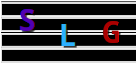

# Song Lyrics Generator
AI-based song lyrics generator trained on data scraped from AZ Lyrics, Tekstowo and others. The generator is currently based on simple Markov chain,
but it will be expanded to include even recursive neural networks version or the chain modifications.

## How to run?
1. Execute `pip3 install -r requirements.txt` to install all dependencies.
2. Open Python shell (just `python3` command) and enter `nltk.download("punkt")`.
3. Run `python3 main.py`, then select "Prepare data".
4. Pick your desired song type from the menu :)

## Authors
- Sebastian Kutny
- Tomasz Lewandowski
- Maciej Kryżanowski
